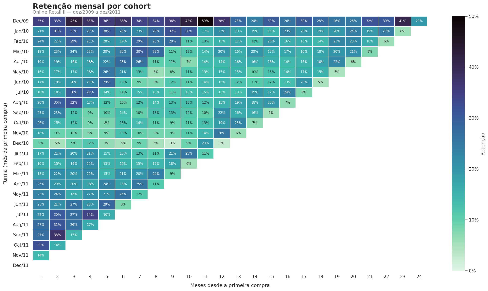

# Análise de Cohort e Previsão de Churn — E-commerce

Segundo projeto do meu portfólio de dados. Peguei as transações de um
e-commerce do Reino Unido (Online Retail II, cerca de 1 milhão de linhas
entre 2009 e 2011) pra entender quantos clientes voltam a comprar depois
da primeira compra e, na sequência, treinar um modelo que aponta quais
clientes têm maior risco de abandonar a loja.

## Etapas

1. Limpeza dos dados (devoluções, valores nulos, registros inválidos) — feito
2. Análise de cohort com heatmap de retenção mensal — feito
3. Criação de variáveis RFM (recência, frequência, valor monetário)
4. Definição de churn e treino do modelo Random Forest
5. Avaliação do modelo e análise das variáveis mais importantes

## Retenção por cohort

Cada linha do heatmap é uma turma de clientes, agrupada pelo mes da primeira
compra. As colunas mostram quantos % dessa turma voltaram a comprar 1, 2, 3...
meses depois. Quanto mais escuro, mais gente voltou.

O que eu vi nos dados:

- A retenção despenca logo no primeiro mes: de 100% pra uma faixa de 14% a
  35%, dependendo da turma. A maior parte dos clientes compra uma vez e não
  volta. O desafio real dessa loja não é atrair cliente, é conseguir a
  segunda compra.
- A turma de dez/2009 é diferente de todas as outras. Segura retenção entre
  26% e 43% por dois anos e chega a bater 50% no decimo mes. Como dez/2009
  é o primeiro mes do dataset, minha leitura é que essa turma carrega os
  clientes antigos da loja, muitos deles atacadistas que recompram todo mes.
- Tem sazonalidade clara: em varias turmas a retenção volta a subir entre
  setembro e outubro. Faz sentido pra uma loja de artigos de presente, os
  revendedores voltam pra montar estoque de fim de ano.
- A turma de dez/2010 foi a pior de todas, rodando entre 3% e 12% quase o
  tempo inteiro. Provavelmente cliente de Natal: comprou presente uma vez
  e nunca mais apareceu.

## Ferramentas

Python (pandas, matplotlib, seaborn), scikit-learn, Google Colab.

